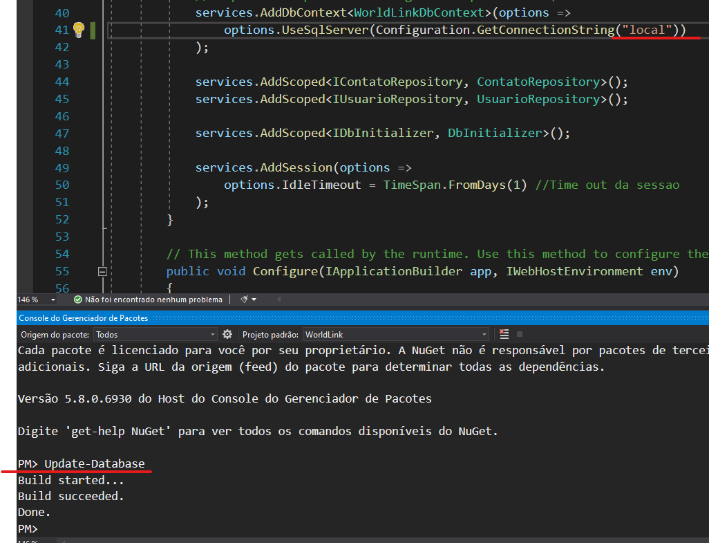
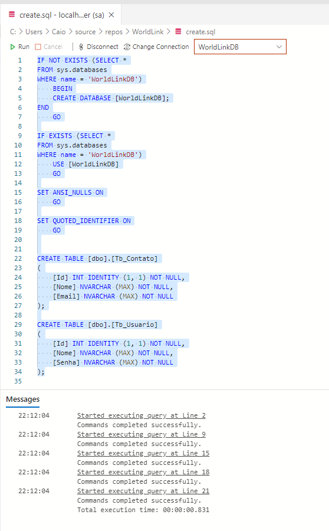

<h1  align="center">
	
</h1>


O WorldLink, foi desenvolvido utilizando **.Net Core** e toda sua stack de desenvolvimento com o **Entity Framework Core**.

##### <a href="https://worldlink-app.azurewebsites.net/" target="_blank">Clique aqui para ver a demo do sistema</a>

<br>

## Setup do Projeto

Basta baixar o projeto e abrir a solução no Visual Studio 2019, assim as dependências serão instaladas.

<br/>

### Configuração do Banco de Dados

Existem três possibilidades para a utilização do banco de dados: 

- Utilizando o banco em memória criado pelo o Entity Framework;
- Utilizando alguma instância do SQLServer que você tenha acesso;
- Utilizando um banco pré-configurado na Azure.


**Visando facilitar o setup, existe uma base de dados na Azure que está configurada, mas caso queria usar outra, base siga o passo a passo:**


No arquivo [`appsettings.json`](./WorldLink/appsettings.json), está presente as strings de conexão para a comunicação com o banco de dados:

````json
{
  ...
  "ConnectionStrings": {
    "local": "Server=(localdb)\\MSSQLLocalDB;Database=WorldLinkDB",
    "sqlserver": "Server=localhost,1433;Database=WorldLinkDB;User Id=sa;Password=sqlcaio@caio;",
    "azure": "Server=tcp:worldlinkdbserver.database.windows.net,1433;Initial Catalog=WorldLinkDB;Persist Security Info=False;User ID=worldlink;Password=Sql@sql123;MultipleActiveResultSets=False;Encrypt=True;TrustServerCertificate=False;"
  }
}

````


O único valor que necessita ser alterado, caso deseja utilizar uma instância própria do SQLServer, seria o valor em `"sqlserver"`.

Para qualquer uma das opções, é necessário verificar a classe [`Startup.cs`](./WorldLink/Startup.cs) e o método `ConfigureServices`, e alterar o parâmetro de `Configuration.GetConnectionString(<string_de_conn>)`

````csharp
public void ConfigureServices(IServiceCollection services)
        {
	    ...
            //Mudar o parametro de Configuration.GetConnectionString(<string_de_conn>),
            //Para o quer usar, como: "azure", "local", "sqlserver"
            services.AddDbContext<WorldLinkDbContext>(options =>
                options.UseSqlServer(Configuration.GetConnectionString("azure"))
            );
	    ...
        }
````

<br>

### Banco em Memória

Se no passo anterior a alteração for para "local", é preciso aplicar as migrations do Entity Framework na base de dados. Para isso siga os passo a baixo:

- Vá no menu `Ferramentas > Gerenciador de Pacotes do NuGet > Console do Gerenciador de Pacotes do NuGet` :

<p align="center">
    
</p>


- Com o console aberto, digite o comando `Update-Database` e o Entity Framework fará as alterações necessárias na base de dados:
<p align="center">
    
</p>


<br/>

### Instância do SQLServer

Para a instância do SQLServer, lembre-se de fazer as alterações em [`appsettings.json`](./WorldLink/appsettings.json) e  [`Startup.cs`](./WorldLink/Startup.cs), explicadas anteriormente. Agora existe duas opções para a criação da base:

- Aplicar os passos para o **Banco em Memória**

  ou

- Executar o script [`create.sql`](./create.sql) em sua base, **caso execute esse passo não aplique as migrations**:
<p align="center">
    
</p>


<br/>

### Instância na Azure

A instancia da Azure, já está pré-configurada, é possivel se conectar fazendo a alteração para `"azure"` em [`Startup.cs`](./WorldLink/Startup.cs).

##### obs: A base na Azure já pode estar populada.
